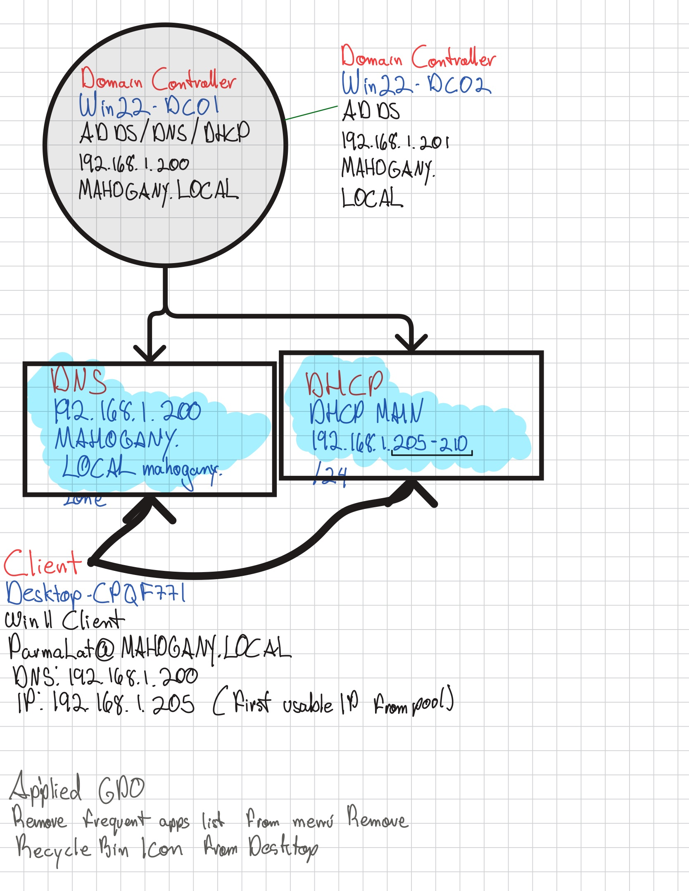
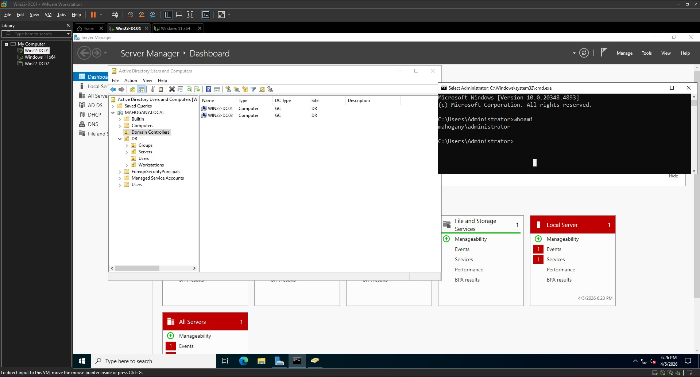
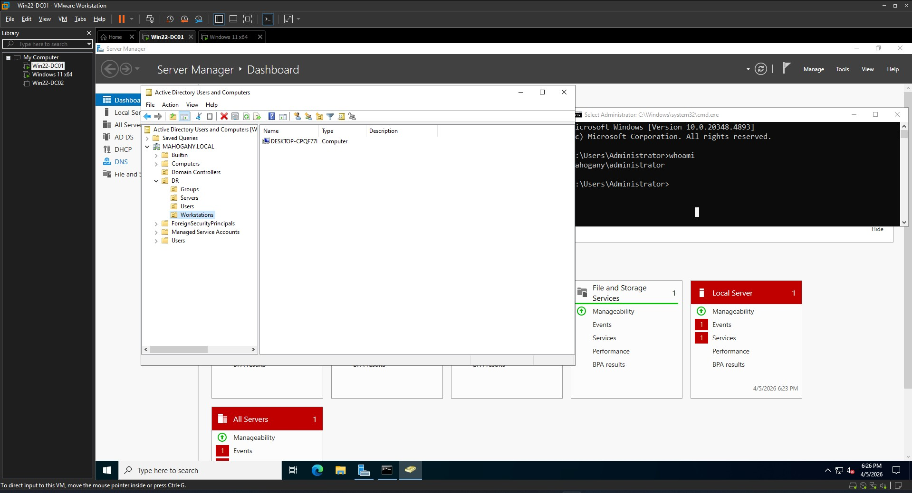

# Windows Server Lab

## Overview
A home lab with 2 Domain Controllers, DNS, DHCP, and a Windows 11 domain-joined client.

## Network Topology

## Screenshots
### Active Directory Structure
Domain Controllers

Users

Computers

#### Windows 11 Client

### DHCP Scope

## Technologies Used
- Windows Server 2022
- Active Directory Domain Services (AD DS)
- DNS Server
- DHCP Server
- Windows 11 Client
